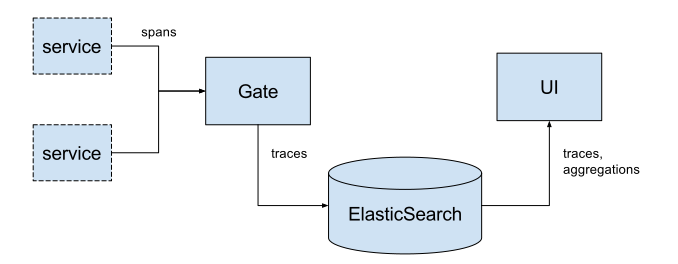
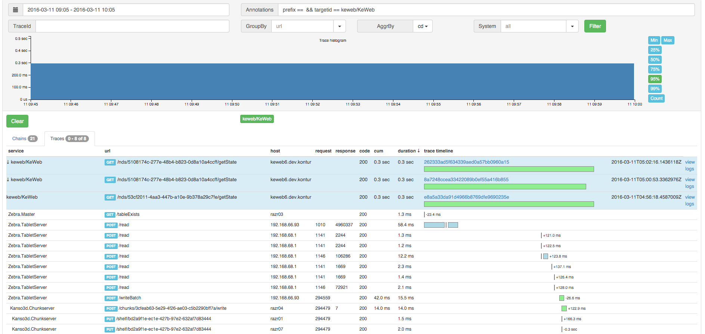

Overview
========

.. _Dapper: http://research.google.com/pubs/pub36356.html
.. _Zipkin: https://github.com/openzipkin/zipkin

DiTrace is a distributed tracing system.

Like the others distributed tracing system as Zipkin_ or Dapper_, DiTrace is an instrument to find the problem zones in distributed systems.

But with different and more simple architecture.

How it works
------------

Every time, when one of distributed system's microservice made a call to another microservice,
the data object, called "span" should be created.

Span has an arbitrary number of annotations such as request and response parameters (timestamps, url, response code, etc).

Spans are belong to one trace in hierarchic order with one root span.

Microservices are responsible for: 

1. Creating traces, spans and sending traceid and spanid within requests between each other.
2. Collecting spans and sending it to the DiTrace gate.

Look :doc:`/api/` for more details.

DiTrace gate are responsible for: 

1. Collecting and grouping spans from multiple microservices
2. Saving traces to elasticsearch

Elasticsearch has a various stats aggregations for data analysis.
UI is an visualization tool for those aggregations and data.

